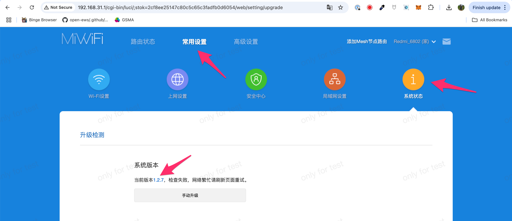

# openwrt-scripts
OpenWRT Scripts

## Instructions

Run the scripts in the following order:

1. `install_openwrt.sh`
2. `make_dumb_ap.sh`
3. `make_mesh_point.sh`

## Notes

After running `make_dumb_ap.sh` plug the network cable from the LAN port of the new device to the LAN port of the main router and check the main router for the IP address of the new device.

## Flash Redmi AX6S

1. Plug in the router via an Ethernet cable connected directly to your computer.

2. Configure DHCP with a simple password: e.g. `12345678`. Refresh and login.

3. Downgrade firmware to 1.2.7: [https://github.com/YangWang92/AX6S-unlock/raw/master/miwifi_rb03_firmware_stable_1.2.7.bin](https://github.com/YangWang92/AX6S-unlock/raw/master/miwifi_rb03_firmware_stable_1.2.7.bin)

4. Run `python3 unlock_pwd.py "S/N"`. Serial number can be found on the back of the device.

5. `$ telnet 192.168.31.1`. Username: `root`, password: from previous step.

6. Download the OpenWrt firmware from: [https://openwrt.org/toh/xiaomi/ax3200](https://openwrt.org/toh/xiaomi/ax3200)

7. Start a http server in the same directory you downloaded the firmware: `python3 -m http.server`

8. Copy contents from `install_openwrt.sh` and paste into the telnet session.

9. OpenWrt should be flashed. Visit [http://192.168.1.1](http://192.168.1.1)
